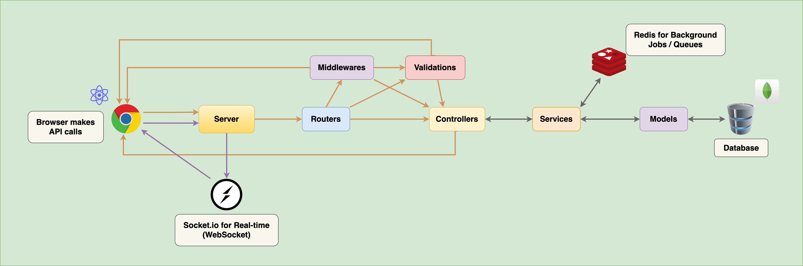

# TaskFlow
## A popular, simple, and easy-to-use collaboration tool that enables you to organize projects and everything related to them into boards.

### Features

- **Task Management**: Create, assign, and track tasks within the board.
- **Collaboration**: Invite team members to collaborate on tasks.
- **Kanban Board**: Visualize tasks in a kanban board format.
- **Task Details**: View and edit task details.

### Technologies Used

- **Frontend**: React, Vite, Material UI
- **Backend**: Node.js, Express, MongoDB
- **Authentication**: JSON Web Tokens (JWT)

### Installation

1. Clone the repository:
   ```
   git clone https://github.com/hantbk/taskflow.git
   cd taskflow
   ```

2. Start frontend:
   ```
   cd frontend
   yarn && yarn dev
   ```

3. Start backend:
   ```
   cd backend
   yarn && yarn dev
   ```
### ERD


### Schema


### Backend Flow

