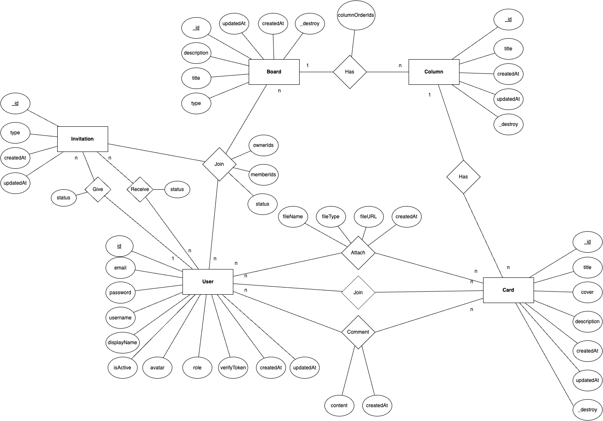
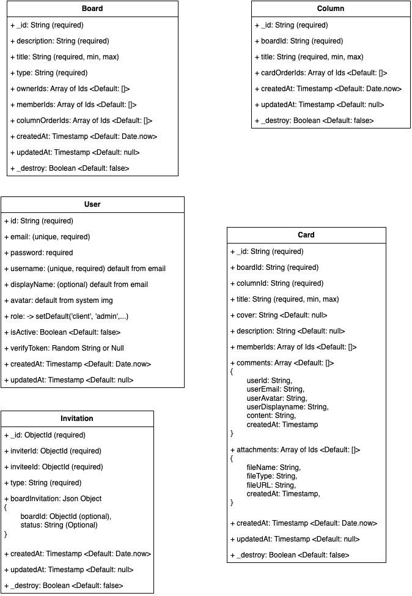
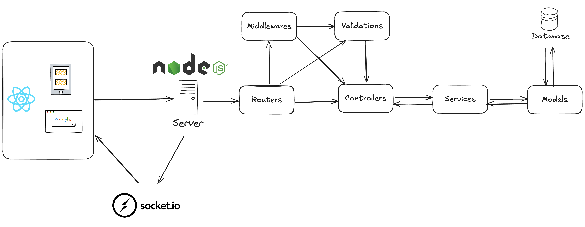

# TaskFlow

## A popular, simple, and easy-to-use collaboration tool that enables you to organize projects and everything related to them into boards. It is a simple and intuitive tool that helps you manage your projects and tasks more efficiently

### Features

- **Login/Registration**: Secure login and registration using JWT.
- **Send Email**: Send email to verify email address.
- **Board Management**: Create, update, and delete boards.
- **Task Management**: Create, assign, and track tasks within the board.
- **Collaboration**: Invite team members to collaborate on tasks.
- **Kanban Board**: Visualize tasks in a kanban board format.
- **Task Details**: View and edit task details.
- **Real-time Invites**: Receive real-time notifications when invited to a board.
- **Dark/Light/System Mode**: Toggle between dark, light, and system theme.
- **Responsive Design**: Fully responsive design that works on all devices.
- **Drag and Drop**: Drag and drop tasks between columns.
- **Search**: Search for boards and tasks.
- **User Profile**: View and update user profile.
- **Logout**: Securely logout from the application.

### Technologies Used

- **Frontend**: React, Vite, Material UI
- **Backend**: Node.js, Express, MongoDB, Socket.IO
- **Authentication**: JSON Web Tokens (JWT)

### Installation

1. Clone the repository:

   ```bash
   git clone https://github.com/hantbk/taskflow.git
   cd taskflow
   ```

2. Start frontend:

   ```bash
   cd frontend
   yarn && yarn dev
   ```

3. Start backend:

   ```bash
   cd backend
   yarn && yarn dev
   ```

   Open your browser and navigate to `http://localhost:5173` to access the application.

### If you want to use docker, you can use the following commands

1. Define the environment variables in the `.env` file:

   ```bash
   cp .env.example .env
   ```

Ensure that the environment variables are correctly set in the `.env` file.

2. Build the Docker images and start the containers:

   ```bash
   docker-compose -f docker-compose.dev.yml up --build
   ```

3. Open your browser and navigate to `http://localhost` to access the application.

### Screenshots

### ERD Diagram



### Schema Diagram



### Backend Flow


